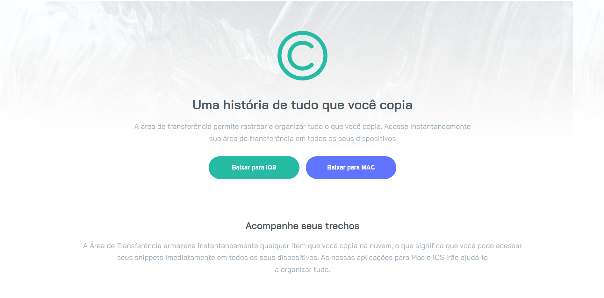

# 🧠 Desafio Frontend Mentor | Clipboard

[Acesse](https://prdsilva80.github.io/clipboard-lp/)

---

## 🛠️ Tecnologias

  

---

## 👨‍🎓 O que aprndi

- Como definir classes para cada parte do projeto
- Sobrepôr figuras usando o 'before' e o 'z-index'
- Alinhar os textos e as figuras
- Delimitar espaços com o 'border-box'
- Buscar ajuda na comunidade tech no 'Discord'
- Fazer uso de Tag's semânticas

---

## 📧 Contato

<a href = "mailto:probertos717@gmail.com">

[Frontend Mentor](https://www.frontendmentor.io/)